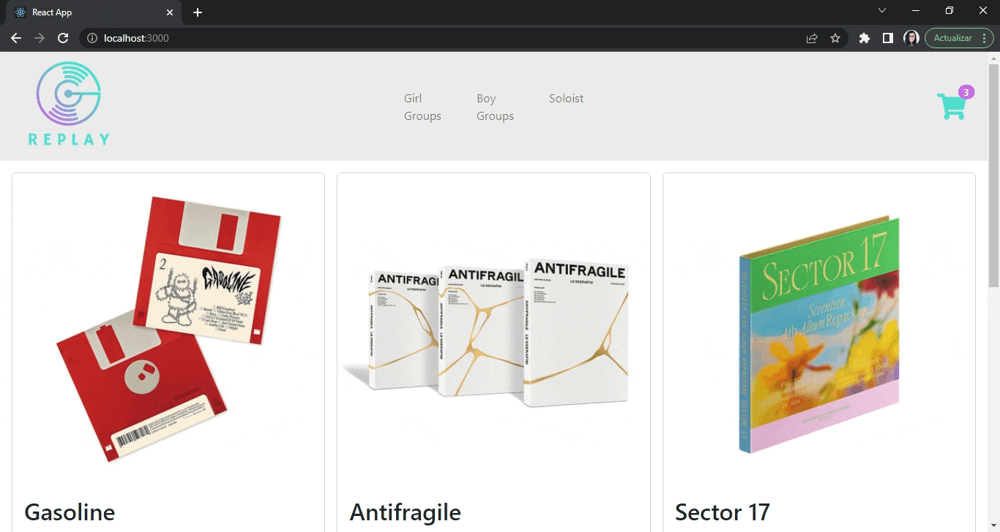
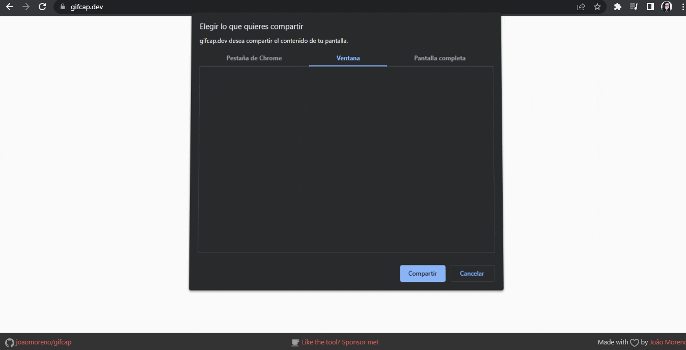

# REPLAY K-POP STORE
## Proyecto de E-commerce con React Js

*Tienda de Albumes de K-Pop, organizados segun categorias (Girl Groups, Boy Groups, Solistas)*

Autor: Carla Mantegazza

***
### Notas para el corrector
#### Site
[En Netlify] (https://replaystore.netlify.app)

#### Navegabilidad

#### Librerias
- [react-icons] (https://react-icons.github.io/react-icons)

Usada para personalizar alertas e iconos.

- [react-toastify] (https://fkhadra.github.io/react-toastify/introduction/)

Usada para crear toast ante eventos del usuario (agregar item, vaciar carrito, etc).

- [spinners-react] (https://www.npmjs.com/package/spinners-react)

Usada para pantallas de carga.

